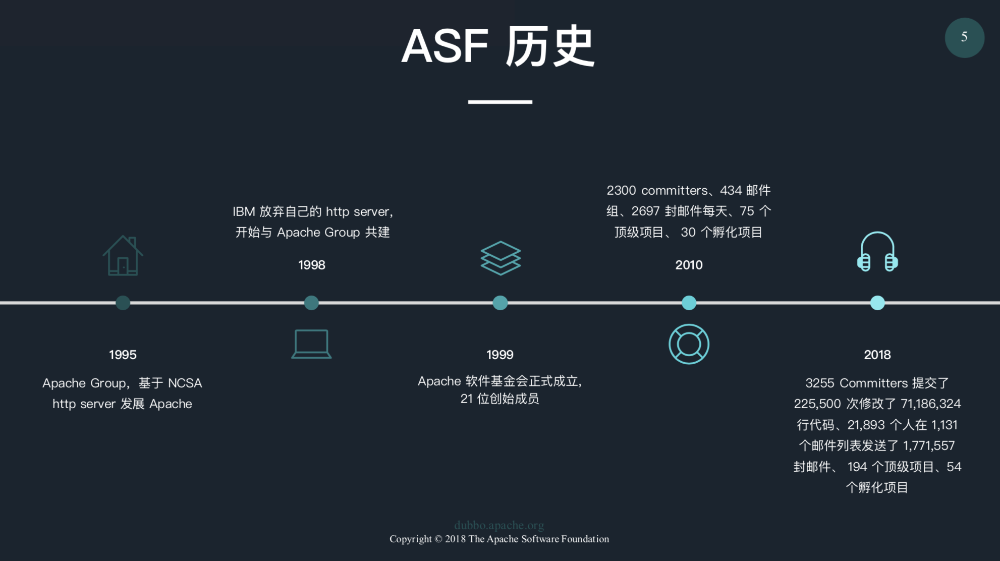
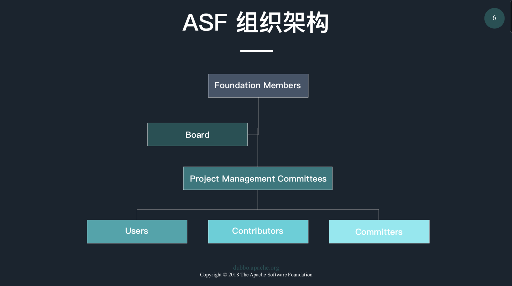
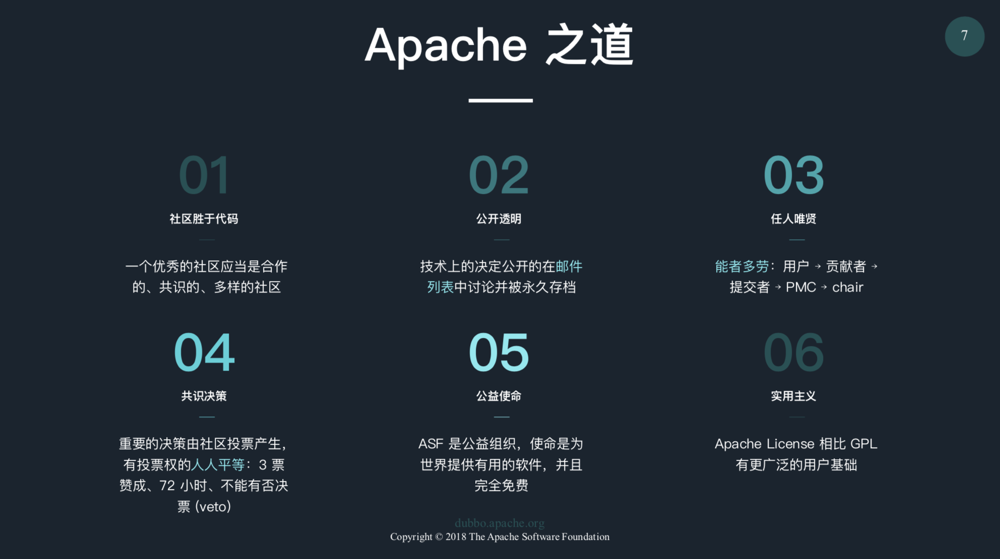
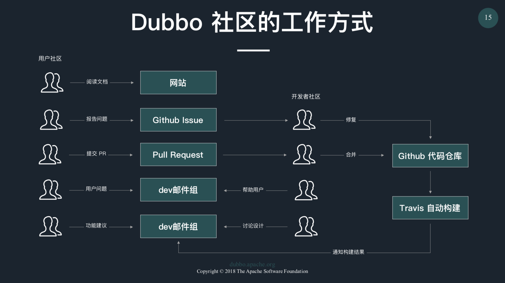
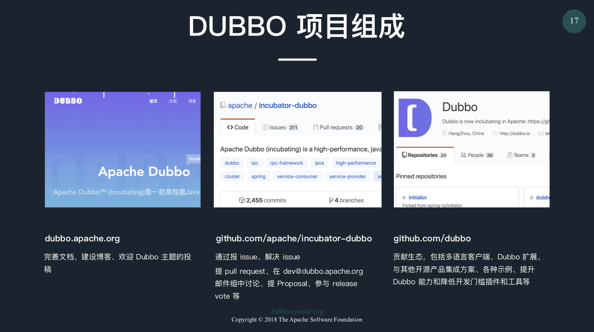
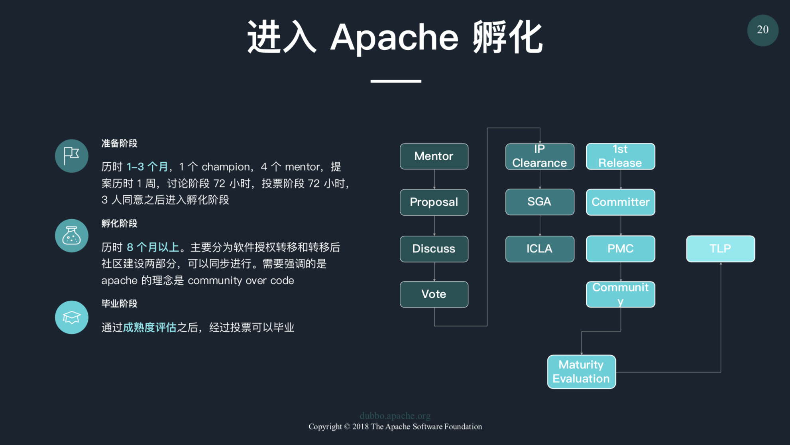

# 如何参与贡献Dubbo社区

## 前言

本文首次分享是在Apache Dubbo(incubating)成都meetup上，这个话题是第一次在meetup上讲，不是我们没有更好的话题吗？相反，我们认为这个话题非常重要，建议这个话题以后每次meetup都要讲。

Dubbo的发展历史大家应该并不陌生了，这里我还是简单回顾一下。Dubbo于2011年在github开源，后面几年由于一些原因停止了维护，直接去年7月份阿里重启维护，并于2018年2月16日捐献给Apache。

为什么会选择捐献给Apache，主要是为了打消社区对Dubbo未来发展的顾虑，给Dubbo用户足够的信心；Apache认为`社区大于代码`，非常注重多样性，强调一个项⽬需要有多个公司和个人贡献者参与，现在Dubbo的发展完全是按`The Apache Way`社区化的方式来运作的。

## Apache的诞生

说到Apache，大家都非常熟悉了，它是全球目前最大的软件基金；Apache的很多项目我们都用过，比如Maven、Log4j、Tomcat等，但有一个项目要特别强调的，那就是 Apache httpd server，这是Apache的第一个项目。

Apache软件基金会正式创建于1999年，主要是为公众提供有用的免费软件，并为软件开发者社区提供支持和服务；它的创建者是一个自称为`Apache组织`的群体；

早在1995年，这个组织就存在了，他们聚集在一起，在美国伊利诺伊大学超级计算机应用程序国家中心开发的NCSA HTTPd服务器的基础上开发与维护了一个叫Apache的HTTP服务器。

最早NCSA HTTPd服务器是一个叫Rob McCool的人开发的，但是后来慢慢失去了兴趣，导致这个功能强大又好用的服务器没人维护；于是一些爱好者和用户就自发开始维护起来，并不断改善功能、发布版本；为了更好进行沟通，一哥们就创建了一个邮件组，并把维护工作高效组织起来，且自称是`Apache组织`，并把这个软件叫`Apache 服务器`。

这也是为什么Apache的所有的项目到今天为止依然以邮件列表作为沟通的主要方式。

关于Apache的命名来源，从北美当地的一支叫`Apache`的印第安部落名称而来，这支部落以高超的军事素养和超人的忍耐力著称，19世纪后半期对侵占他们领土的入侵者进行了反抗；为了对这支部落表示敬仰，就取了这个名字；但这里还流传着一个小故事，说是在NCSA HTTPd基础上，大家都通过打补丁不断在修改这个软件，被戏称为`A Patchy Server`，和`Apache Server`读音很像。

随着后来商业需求扩大，围绕Apache HTTP服务器的项目越来越多，后来越来越多的项目启动，也有很多外部组织捐献项目；为了让这些外部项目能顺利进入到Apache基金会，2002年创建了Incubator（孵化）项目。可以看到，经过10多年的发展，到2010年，75个顶级项目，30个孵化项目，每天2697封讨论邮件；2018年这个数据进一步增长，194个顶级项目，54个孵化项目，3255个committers；其中中国人主导的项目，有RocketMQ，WeeX，ECharts，Skywalking等。

Dubbo正在成为Apache顶级项目的路上——Apache孵化项目中。

回顾一下Apache这些历史和数据，我们不难发现几个关键词：兴趣、参与、邮件；这些就是我们后面要重点介绍的`The Apache Way`。

## ASF组织架构

我们知道每个组织都有它自己的架构，ASF同样也不例外；那Apache的组织架构是什么样的呢？它有什么独特的地方吗？这里特别要强调的是Project Management Committees，即 PMC，每个项目从孵化阶段开始就会有PMC，主要负责保证开源项目的社区活动都能运转良好，这里运转的机制就是`The Apache Way`。

图中，Board就是负责整个基金会符合章程的运作。Board我们一般很少能接触到，接触更多的是PMC以及下面的这几层。

参与Apache项目社区活动的人，一般分为以下几类：

* 直接用户：在座的都是Dubbo的用户，可能部分现在还不是，但将来肯定会是

* 贡献者：部分用户在使用Dubbo过程中，遇到问题，自己通过分析调试找到解决方案，并提交给Dubbo官方，最终被接受，这些用户就是Dubbo的贡献者

* 提交者：贡献多了，经过PMC的提议和投票，就会成为Committer；Committer即意味着正式加入Apache，拥有个人Apache帐号以及相应项目的写权限

* PMC：Committer再往上走就是PMC，这个必须由现有PMC成员提名

个人在社区的成长，就像我们在公司晋升一样，一步一步往上走。

本文的目的就是告诉大家，从User到Contributor没有大家想像的那么难，从Contributor到Committer也不是不可能；只要大家拥有一颗开源的心，找到自己感兴趣的项目，并持续投入，付出肯定会有回报。

## The Apache Way

就像你加入一家公司需要了解这家公司的文化一样，参与Apache开源项目之前，同样我们需要需要了解ASF的文化，这个文化就称为`The Apache Way`。

这里想特别强调以下几点：

* 社区胜于代码：把项目构建出来这不是开源，去构建社区才是真正的开源；对社区而言，一切都是围绕代码而生，无代码则社区不复存在；在代码之上，则是如何做事、如何待人、如何决策的理念体现；一个健康的社区远比优秀的代码重要——如果代码奇烂无比，社区可以重写，但社区有了毛病，代码最终也会付之东流；
* 公开透明与共识决策：`If it doesn't happen on email, it doesn't happen.` 所有的决定，不管是技术feature、发展方向，还是版本发布等，都应该被公开讨论，而形式就是邮件列表，这些讨论过程和结论都会被永久存档；而讨论的过程，就是大家自由发表意见的过程，但最终大家要投票，比较民主的做法；
* 任人唯贤：`Those that have proven they can do, get to do more.` 特别强调一点，贡献绝不仅仅是代码，贡献可以是很多方面，接下来我们结合Dubbo来讲，大家如何参与并贡献；

## 参与Dubbo社区

要参与Dubbo社区，就要先大概了解一下目前社区的工作方式。总结一句话就是4个角色、3个途径以及2个代码组；

1. 4个角色前面也提到过了，分别是User、Contributor、Committer、PPMC；这里特别要强调用的是，角色之间不是孤立的，比如提功能建议的也可以是Committer或Contributor等；PPMC有投票权，但其他人一样也可以投票，这本身就是一种参与、一种贡献；
2. 3个途径，分别是Dubbo官网、github、dev邮件列表；目前比较活跃的是github issue/PR；我们鼓励按`The Apache Way`的方式，使用邮件列表交流，让导师看到我们的贡献；
3. 2个代码组，一个是 `github.com/apache/incubator-dubbo*` ，这里是dubbo孵化的项目，目前主要包含dubbo-rpc、dubbo-spring-boot-start、dubbo-ops三个部分；另外一个就是 `github.com/dubbo`，这个是dubbo作为微服务解决方案的所有相关的生态部分，包括dubbo-rpc的扩展、dubbo与其他产品集成、dubbo多语言客户端实现以及一些工具和套件等；

所以，对于想参与Dubbo社区、想为Dubbo这个微服务解决方案自己一份力量的人来说，以下就是你们现在就可以开始做的：

1. 开发邮件组可以订阅起来，可以参考这里：https://github.com/apache/incubator-dubbo/wiki/Mailing-list-subscription-guide
2. github.com/apache/incubator-dubbo star起来，fork起来
3. 学习中英文文档，进行修正或优化，提PR；有疑问的地方，可以email到邮件组或提issue；官方开发者的回复总比google或stackoverflow里找到的答案要强的多吧？
4. 如果你正在使用dubbo，可以将经验总结出来，写篇blog，分享给社区；真实的案例总是最具有说服力；
5. 如果你有时间，可以参与issue和PR的解决，回条用户的问题、PR的review；`Good first issue`以及`Help wanted`的issue，总有一个是适合你的；
6. 如果你想深入学习dubbo-rpc框架，UT是一个非常好的开始，完善和补充现有的UT，一边学习一边贡献，何乐而不为？
7. 发现了bug，报issue；通过自己的努力最终解决了，提一个issue，`first-contributor`并不是那么难；哦，对了，拼写错误也算哦；
8. 如果你发现一个可以帮助用户更方便地使用dubbo，开发、测试、调试、mock、工具等；都可以贡献到Dubbo生态中来；
9. 最后我们非常欢迎大家通过邮件提想法，也欢迎大家多讨论；你会发现，技术变牛的同时，英文也变的66的了；

## 加入Apache孵化

如果大家有好的项目希望捐献给Apache，这个流程可以参考一下；

进⼊ Apache 分为三个阶段，准备阶段、孵化阶段和毕业阶段。准备阶段需要做的事情有找到愿意帮助孵化的导师，向Apache 提交进⼊孵化的申请，经过导师们讨论并投票，如果通过的话就可以进⼊入孵化。孵化阶段分为两大环节，第⼀个环节是公司和个人签署协议向Apache 移交代码和知识产权，之后就是在导师的指导下按照Apache的规范做版本迭代、社区运营、发展更多的Committer；如果最终通过了成熟度评估，就可以顺利毕业成为Apache的顶级项目。

## 结语

希望越来越多的公司团队和个人能够贡献到国际化的开源社区里去，一起打造我们中国的开源品牌！也希望大家都能愉快去贡献，罗马非一日建成，但付出一定会有回报。

这里透露一个小福利，所有Apache Committer可以免费使用InteliJ的全套付费产品，包括全宇宙最好用的IDEA。